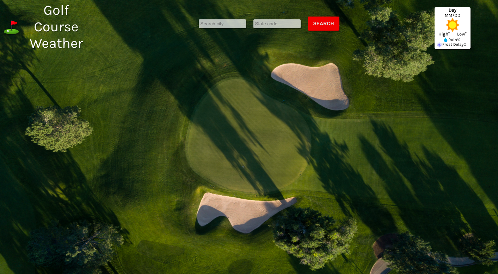
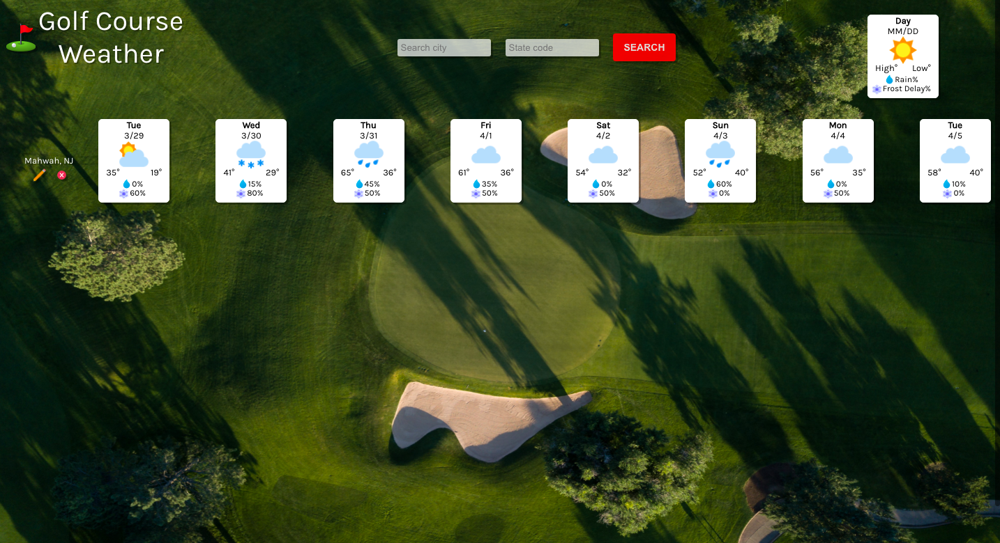
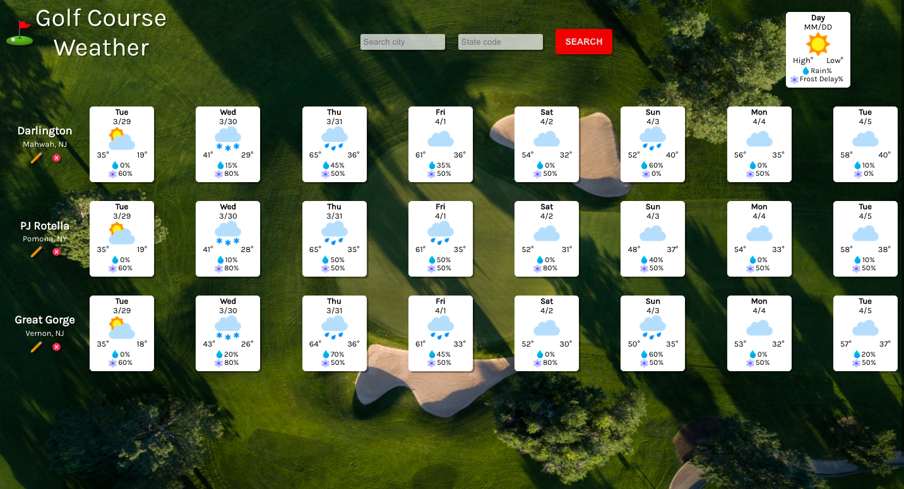

# Golf Course Weather

This app helps to compare an 8-day weather forecast of different golf courses in your area. 

## Live Demo

https://byunghun3.github.io/golf-course-weather/

## Technologies

This project was created with:

* React.js
* SASS/SCSS
* Jest

## Usage

You can search the location of your golf course in city name and state code format in the search bar.

You'll get an 8-day weather forecast detailing weather conditions, high and low temperatures, chance of rain, and chance of frost delay.

In the top right corner of the page, there's a legend for the weather card.

The pencil icon will allow you to edit/save the golf course name, so that it's easy to compare different courses at a glance.

You can save as many courses as you need to get a side-by-side weather comparison for the upcoming week.

## Reflection

My goal for this project was to build an app using React class components and to practice consuming an API.

Golf became my hobby during the COVID pandemic. There were times when my weekend round would be spoiled due to bad weather, only for me to notice that another course that was a half-hour drive from my house in the opposite direction was dry and in perfect playing condition that same day.

From playing rounds with my family, I noticed that we were generally willing to travel within 1 hour driving radius from our house. So I wanted to streamline the tedious process of looking up weather forecasts for each town individually.

I intentionally decided to use class components for my first React project, because I wanted to understand firsthand the improvements that using functional components could bring in a later project. I also wanted to be a developer who doesn't shy away from programming methods such as class components just because they're less favored in the industry, when there is still a good chance that I could be working with legacy codes containing them in a professional environment.

I used Axios to call the weather forecast through Weatherbit API. I found Axios's syntax to be logical and clean. While I don't feel super comfortable working with APIs yet, I thought this was a nice starting point and I hope to practice more in future projects with both internal and external APIs.

For styling, I started with regular CSS files, then migrated them into SCSS files at the end when I was cleaning up my code. I wanted to focus first on getting my codes up and running, since it was my first React project. Then, I saw an opportunity where the same color, opacity, or box shadow properties were used in multiple places, so decided to unite the styles with SASS.

I also returned a couple months after the initial completion to add in testing for the first time in any of my apps. I kept hearing about how tedious and intimidating testing can feel, but I found myself enjoying writing tests for their similarly logical but unique syntax to the rest of the code. 

From this project, I felt that React can be more efficient than vanilla JS when my project contains more functionalities and interactivity between components. I learned how to style a single-page app without relying on libraries such as Bootstrap or Material UI. I was able to appreciate how SASS really helps with managing consistency in style. I also learned the basics of React state and props and the ways to display, edit, save, delete data on the page.

For my next React project, I want to learn and use React functional components, Typescript, and Material UI to build a multi-page app.
